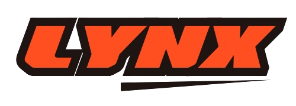

<p align="center">
    </a>
</p>

> [!CAUTION]
> Currently in beta.

## About Lynx

Lynx is a self-hosted link shortner application. It  allows you to shorten, track, and manage links with ease.

**Features**
- Choice pages
- Customizable slug
- Password protected links
- QR Code
- Create multiple teams
- Custom domains
- Analytics

## Requirements

- PHP 8.2
- Laravel 11.x
- Filament 3.x
- Sqlite 

## Installing locally

Follow below steps to install it locally -

### Clone repository

```bash
git clone https://github.com/frikishaan/lynx.git
```
### Install dependencies

```bash
composer install

npm install

npm run build
```

### Run database migrations

```bash
php artisan migrate
```

### Optionally, seed the test data

```bash
php artisan db:seed
```

<!-- ## Security Vulnerabilities

If you discover a security vulnerability within Lynx, please send an e-mail to Ishan via [hey@frikishaan.com](mailto:hey@frikishaan.com). All security vulnerabilities will be promptly addressed. -->

## License

[Lynx license](./LICENSE.md)
